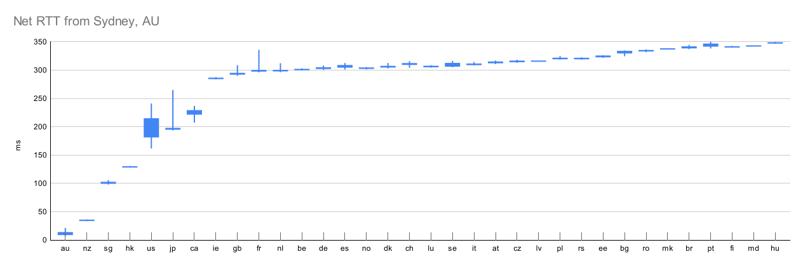

Assorted helper programs that may come in handy when tuning a `mlvd-sample` sampler policy.

Some of these programs depend on third-party libraries.  Refer to module docstrings, found at the head of each file, for specific advice.

Data from `mlvd-ping` can be used to generate latency plots.  (Plot generator not included.  The example below was generated with Google Sheets.)

